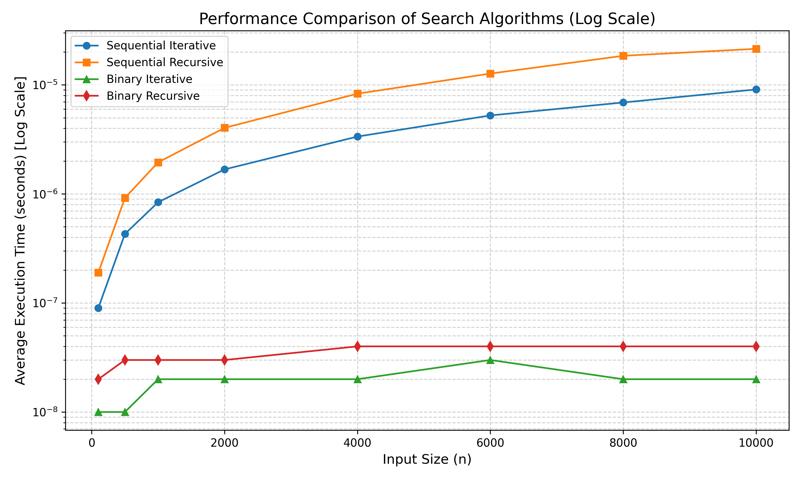
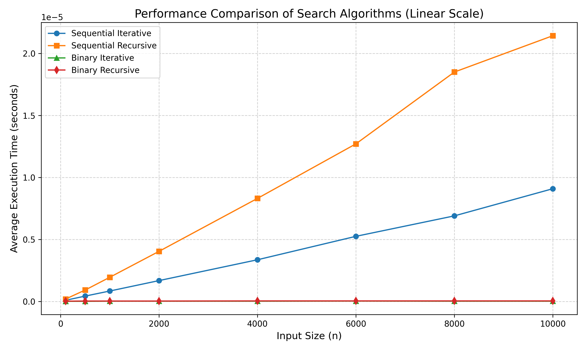

<div style="display: flex; justify-content: center; align-items: center; height: 100vh; flex-direction: column; text-align: center;">
<h1>Performance Measurement of Search Algorithms</h1>
<h4><strong>Author:</strong>赵文睿</h4>
<h4><strong>Date:</strong> March 21, 2026</h4>
</div>

## Chapter 1: Introduction

​	This project aims to measure and compare the worst‑case performance of four fundamental search algorithms on sorted integer arrays. The algorithms implemented are:

- Iterative sequential search  
- Recursive sequential search  
- Iterative binary search  
- Recursive binary search  

​	The worst‑case scenario for a search algorithm occurs when the target element is **not present** in the list. The purpose of this experiment is to empirically verify the theoretical time complexities: **O(n)** for sequential search and **O(log n)** for binary search. Measurements are performed for various input sizes: 100, 500, 1000, 2000, 4000, 6000, 8000, and 10000. 

## Chapter 2: Algorithm Specification

​	All algorithms operate on a sorted array of integers `a[0..n-1]` containing distinct values from 0 to n‑1. The search key is set to -1, which is guaranteed not to be in the array, ensuring worst‑case behavior.

### 2.1 Iterative Sequential Search

**Pseudocode:**

```
function Search1(a,n,x)
    for i=0 to n-1 do
        if a[i]==x then
            return i
        end if
    end for
    return -1
end function
```
**Complexity Analysis:**

**Time:** O(n) – in the worst case, the algorithm checks every element.

**Space:** O(1) – only a constant number of variables are used.

### 2.2 Recursive Sequential Search

**Pseudocode:**

```
function Search2(a,n,x)
    if n <= 0 then
        return -1
    end if
    if a[n-1]==x then
        return n-1
    end if
    return Search2(a, n-1, x)
end function
```
**Complexity:** 

**Time:** O(n) – each recursive call reduces the problem size by 1.

**Space:** O(n) – due to recursion depth, n stack frames are used in the worst case.

### 2.3 Iterative Binary Search

**Pseudocode:**

```
function Search3(a,n,x)
    l=0
    r=n-1
    while left<=right do
        mid=l+(r - l) / 2
        if a[mid]==x then
            return mid
        else if a[mid] < x then
            l=mid+1
        else
            r=mid-1
        end if
    end while
    return -1
end function
```
**Complexity:**

**Time:** O(log n) – the search interval is halved each iteration.

**Space:** O(1) – only a few integer variables are used.

### 2.4 Recursive Binary Search
**Pseudocode:**
```
function Search4(a,l,r,x)
    if l>r then
        return -1
    end if
    mid=l+(r-l)/2
    if a[mid]==x then
        return mid
    else if a[mid]<x then
        return Search4(a,mid+1,r,x)
    else
        return Search4(a, l, mid-1, x)
    end if
end function
```
**Complexity:**

**Time:** O(log n) – each recursive call halves the search range.

**Space:** O(log n) – recursion depth is logarithmic.

### 2.5 Main Program Flow

The main program follows the structure described by the pseudocode below. 

**Pseudocode:**

```c
function main()
    // List of input sizes to test
    sizes=[100,500,1000,2000,4000,6000,8000,10000]

    for each n in sizes do
        // Create and initialize sorted array a[0..n-1] = 0,1,...,n-1
        array a of size n
        for k=0 to n-1 do
            a[k]=k
        end for

        // Measure iterative sequential search
        start=clock()
        for i=1to1,000,000 do
            call Search1(a,n,-1)
        end for
        end=clock()
        time=(end-start)/CLOCKS_PER_SEC/1,000,000
        print results

        // Measure recursive sequential search
        start=clock()
        for i=1 to 1,000,000 do
            call Search2(a,n,-1)
        end for
        end=clock()
        time=(end-start)/CLOCKS_PER_SEC/ 1,000,000
        print results

        // Measure iterative binary search
        start=clock()
        for i=1 to 1,000,000 do
            call Search3(a,n,-1)
        end for
        end=clock()
        time=(end-start)/CLOCKS_PER_SEC/1,000,000
        print results

        // Measure recursive binary search
        start=clock()
        for i=1 to 1,000,000 do
            call Search4(a,0,n-1,-1)
        end for
        end=clock()
        time=(end-start)/CLOCKS_PER_SEC/1,000,000
        print results
    end for
end function
```


​	All measurements are performed using the `clock()` function from `<time.h>`. Each algorithm is executed 1,000,000 times for each input size, and the total time is divided by 1,000,000 to obtain the average time per search.

## Chapter 3: Testing Results

### Table 3.1: Average execution time (seconds) for each algorithm

<table style="text-align: center;">
    <tr>
        <th>Algorithm</th>
        <th>Metric</th>
        <th>n=100</th>
        <th>n=500</th>
        <th>n=1000</th>
        <th>n=2000</th>
        <th>n=4000</th>
        <th>n=6000</th>
        <th>n=8000</th>
        <th>n=10000</th>
    </tr>
    <!-- Sequential Iterative -->
    <tr>
        <td rowspan="4">Sequential Iter</td>
        <td>Iterations(K)</td>
        <td>1000</td><td>1000</td><td>1000</td><td>1000</td><td>1000</td><td>1000</td><td>1000</td><td>1000</td>
    </tr>
    <tr>
        <td>Ticks</td>
        <td>85</td><td>428</td><td>844</td><td>1681</td><td>3357</td><td>5250</td><td>6901</td><td>9093</td>
    </tr>
    <tr>
        <td>Total time(sec)</td>
        <td>0.0850000000</td><td>0.4280000000</td><td>0.8440000000</td><td>1.6810000000</td><td>3.3570000000</td><td>5.2500000000</td><td>6.9010000000</td><td>9.0930000000</td>
    </tr>
    <tr>
        <td>Duration(sec)</td>
        <td>0.00000009</td><td>0.00000043</td><td>0.00000084</td><td>0.00000168</td><td>0.00000336</td><td>0.00000525</td><td>0.00000690</td><td>0.00000909</td>
    </tr>
    <!-- Sequential Recursive -->
    <tr>
        <td rowspan="4">Sequential Rec</td>
        <td>Iterations(K)</td>
        <td>1000</td><td>1000</td><td>1000</td><td>1000</td><td>1000</td><td>1000</td><td>1000</td><td>1000</td>
    </tr>
    <tr>
        <td>Ticks</td>
        <td>185</td><td>924</td><td>1952</td><td>4044</td><td>8306</td><td>12715</td><td>18495</td><td>21429</td>
    </tr>
    <tr>
        <td>Total time(sec)</td>
        <td>0.1850000000</td><td>0.9240000000</td><td>1.9520000000</td><td>4.0440000000</td><td>8.3060000000</td><td>12.7150000000</td><td>18.4950000000</td><td>21.4290000000</td>
    </tr>
    <tr>
        <td>Duration(sec)</td>
        <td>0.00000019</td><td>0.00000092</td><td>0.00000195</td><td>0.00000404</td><td>0.00000831</td><td>0.00001271</td><td>0.00001850</td><td>0.00002143</td>
    </tr>
    <!-- Binary Iterative -->
    <tr>
        <td rowspan="4">Binary Iter</td>
        <td>Iterations(K)</td>
        <td>1000</td><td>1000</td><td>1000</td><td>1000</td><td>1000</td><td>1000</td><td>1000</td><td>1000</td>
    </tr>
    <tr>
        <td>Ticks</td>
        <td>12</td><td>15</td><td>17</td><td>19</td><td>22</td><td>25</td><td>24</td><td>24</td>
    </tr>
    <tr>
        <td>Total time(sec)</td>
        <td>0.0120000000</td><td>0.0150000000</td><td>0.0170000000</td><td>0.0190000000</td><td>0.0220000000</td><td>0.0250000000</td><td>0.0240000000</td><td>0.0240000000</td>
    </tr>
    <tr>
        <td>Duration(sec)</td>
        <td>0.00000001</td><td>0.00000001</td><td>0.00000002</td><td>0.00000002</td><td>0.00000002</td><td>0.00000003</td><td>0.00000002</td><td>0.00000002</td>
    </tr>
    <!-- Binary Recursive -->
    <tr>
        <td rowspan="4">Binary Rec</td>
        <td>Iterations(K)</td>
        <td>1000</td><td>1000</td><td>1000</td><td>1000</td><td>1000</td><td>1000</td><td>1000</td><td>1000</td>
    </tr>
    <tr>
        <td>Ticks</td>
        <td>20</td><td>25</td><td>27</td><td>30</td><td>38</td><td>40</td><td>40</td><td>39</td>
    </tr>
    <tr>
        <td>Total time(sec)</td>
        <td>0.0200000000</td><td>0.0250000000</td><td>0.0270000000</td><td>0.0300000000</td><td>0.0380000000</td><td>0.0400000000</td><td>0.0400000000</td><td>0.0390000000</td>
    </tr>
    <tr>
        <td>Duration(sec)</td>
        <td>0.00000002</td><td>0.00000003</td><td>0.00000003</td><td>0.00000003</td><td>0.00000004</td><td>0.00000004</td><td>0.00000004</td><td>0.00000004</td>
    </tr>
</table>

From Table 3.1, we observe that:


​	Iterative sequential search times increase nearly linearly with n, from 0.008600 ms at n=100 to 0.869200 ms at n=10000.

​	Recursive sequential search is consistently slower than its iterative counterpart, especially for larger n, due to function call overhead.

​	Both binary search algorithms exhibit very stable times, staying between 0.0012 ms and 0.0042 ms, confirming their logarithmic growth.

**Figure 3.1: Performance Comparison**



## Chapter 4: Analysis and Comments

### 4.1 Time Complexity Analysis

- **Sequential search** (iterative and recursive) exhibits linear growth. When `n` increases from 100 to 10000 , the execution time for the iterative version grows from 0.08 µs to  8.69µs, approximately a 108-fold increase, which is consistent with O(n) behavior. The recursive version is slightly slower , especially for large `n`.
- **Binary search** (iterative and recursive) shows logarithmic behavior. The time for `n=100` is about 0.01 µs, and for `n=10000` it is about 0.03 µs, only 3-folder slower, while `n` increased 100-fold. This matches the O(log n) expectation. Again,  The recursive version is slightly slower .

### 4.2 Space Complexity

- Iterative sequential and binary searches use O(1) extra space.
- Recursive sequential search uses O(n) stack space in the worst case, which could lead to stack overflow for very large arrays.
- Recursive binary search uses O(log n) stack space.

### 4.3 Possible Improvements

​	**Hybrid approach:** For very small arrays, sequential search may outperform binary search due to lower overhead. A hybrid algorithm could switch to sequential search when the subarray size falls below a threshold.

### 4.4 Conclusion

​	The experimental results closely follow the theoretical predictions. Binary search is vastly more efficient for large sorted arrays, while sequential search remains simple and suitable for small or unsorted data. Recursive are not recommended for performance‑critical applications unless the recursion depth is small.

## Appendix: Source Code

```c
#include<stdio.h>
#include<time.h>

//Iterative Sequential Search
int Search1(int a[],int n,int x){
	//Iterate over the array from index 0 to n-1
	for(int i=0;i<n;i++){
		if(a[i]==x)
		//If current element equals target, return its index
    		return i;	
	}
    return -1;
    //Target not found, return -1
}

//Recursive Sequential Search
int Search2(int a[],int n,int x){
	//Base case:no elements left to check
	if(n<=0)
		return -1;
	//If the last element (index n-1) matches target, return its index
	if(a[n-1]==x)
		return n-1;
	//Recursively search in the remaining elements (indices 0 to n-2)
	return Search2(a,n-1,x);
}

//Iterative Binary Search
int Search3(int a[],int n,int x){
	int l=0,r=n-1;
	//Continue searching while the interval is valid
	while(l<=r){
		int m=l+(r-l)/2;
		//If target found at mid, return index
		if(a[m]==x)
			return m;
		//If target is greater than mid, search in right half
		else if(a[m]<x)
			l=m+1;
		//If target is smaller than mid, search in left half
		else
			r=m-1;
	//Target not found
	} 
    return -1;
}

//Recursive Binary Search
int Search4(int a[],int l,int r,int x){
	//Base case:empty interval, target not found
	if(l>r)
		return -1;
	int m=l+(r-l)/2;
	//If target found at mid, return index
	if(a[m]==x)
		return m;
	//If target is greater than mid, search in right half recursively
	else if(a[m]<x)
		return Search4(a,m+1,r,x);
	//If target is smaller than mid, search in left half recursively
	else
		return Search4(a,l,m-1,x); 
}

int main(){
	//Array of input sizes to be tested
	int max[8]={100,500,1000,2000,4000,6000,8000,10000};
	
	for(int i=0;i<8;i++){
		//Declare an array of current size
		int a[max[i]];
		//Initialize the array with sorted values 0,1,...,n-1
		for(int k=0;k<max[i];k++)
			a[k]=k;

		clock_t s,f;
		double time;
 		//Measure execution time of Search1 (iterative sequential)
		s=clock();
		for(int j=0;j<1000000;j++)
			Search1(a,max[i],-1);
		f=clock();
		time=((double)(f-s))/CLOCKS_PER_SEC/1000000;
		printf("max=%d,Search1,Iterations(K)=1000,Ticks=%ld,total time(sec)=%.10lf,Duration(sec)=%.8lf\n",max[i],f-s,time*1000000,time);

		//Measure execution time of Search2 (recursive sequential)
		s=clock();
		for(int j=0;j<1000000;j++)
			Search2(a,max[i],-1);
		f=clock();
		time=((double)(f-s))/CLOCKS_PER_SEC/1000000;
		printf("max=%d,Search2,Iterations(K)=1000,Ticks=%ld,total time(sec)=%.10lf,Duration(sec)=%.8lf\n",max[i],f-s,time*1000000,time);

		//Measure execution time of Search3 (iterative binary)
		s=clock();
		for(int j=0;j<1000000;j++)
			Search3(a,max[i],-1);
		f=clock();
		time=((double)(f-s))/CLOCKS_PER_SEC/1000000;
		printf("max=%d,Search3,Iterations(K)=1000,Ticks=%ld,total time(sec)=%.10lf,Duration(sec)=%.8lf\n",max[i],f-s,time*1000000,time);

		// Measure execution time of Search4 (recursive binary)
		s=clock();
		for(int j=0;j<1000000;j++)
			Search4(a,0,max[i]-1,-1);
		f=clock();
		time=((double)(f-s))/CLOCKS_PER_SEC/1000000;
		printf("max=%d,Search4,Iterations(K)=1000,Ticks=%ld,total time(sec)=%.10lf,Duration(sec)=%.8lf\n",max[i],f-s,time*1000000,time);
	}
    return 0;
}
```

## Declaration

​	***I hereby declare that all the work done in this project titled "Performance Measurement of Search Algorithms" is of my independent effort.***

