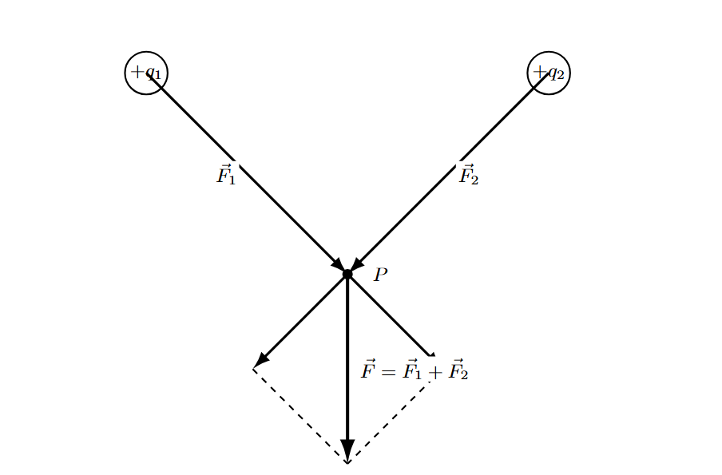
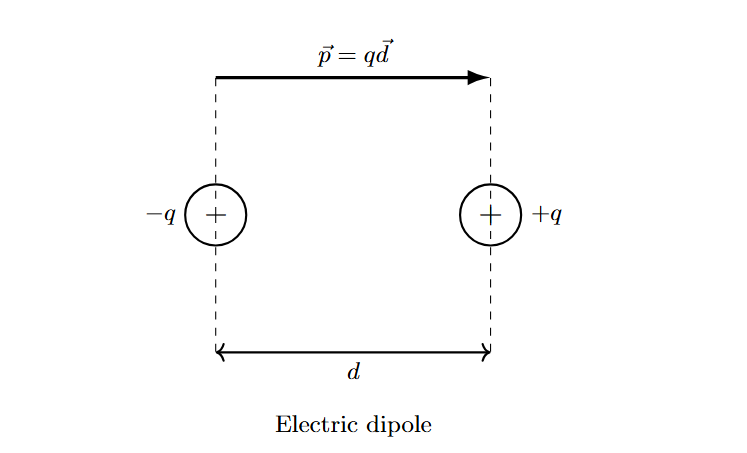

# Coullomb's Law & Electric Field

## 电荷

​	观测到的电荷 q 的电荷量是某一基本电荷 e 的整数倍。

​	通过**密里根油滴实验**可以知道：基本电荷的电荷量 $e=1.602 \times 10^{-19}C$

​	电荷 $q$ 满足 $q=Ne$ ,其中 $N$ 是整数。

​	**电荷守恒**：在任何封闭系统中发生的任何物理过程中，总电荷的代数和保持不变。

​	电荷在洛伦兹变换下是不变的。

## 库仑定律与电场

### 库仑定律

​	分别位于 $\mathbf{r_{1}}$ 和 $\mathbf{r_2}$ 的两个电荷 $q_{1}$ 和 $q_{2}$ 间的作用力

$$
F_{21}=-F_{12}=\frac{q_1q_2}{4 \pi \varepsilon_{0}r_{12}^2}e_{12}^2
$$

其中，$r_{12}=\left|r_2-r_1\right|$ , $e_{12}=\frac{r_2-r_1}{\left|r_2-r_1\right|}$（单位矢量，方向由 $q_1$ 指向 $q_2$）, $\frac{1}{4\pi\varepsilon_0}=9\times \frac{N\cdot m^{2}}{C^2}$

### 场

​	**场**：用图或空间坐标的标量函数表示的物理量的分布，称为场

​	场方向给出该点引力的方向，大小表示该点引力效应的“强度”

​	通过在静电学中引入“电场”，确定电荷之间的库仑力被简化为两个独立问题：
1. 确定第一个电荷分布在每个空间点建立的电场。
2. 计算该场对放置在空间中特定区域的第二个电荷分布施加的力。

$$
\vec{E} = \frac{\vec{F}}{q_0} = \frac{Q}{4\pi\epsilon_0 r^2}\hat{r}\\  
\vec{F} = q\vec{E} = q\frac{Q}{4\pi\epsilon_0 r^2}\hat{r}
$$

​	**电场线**:用于显示电场的大小和方向。任意点的电场大小等于电场线密度。即$|\vec{E}| = \frac{\Delta N}{\Delta A}$

​	**电场线的性质**:

- 电场线起源于正电荷,结束于负电荷
- 任意点的电场大小与垂直于电场线的单位截面积上的电场线数目成正比。
- 电场线不形成闭合曲线。
- 两条电场线在空间任意点都不相交。

### 叠加原理

​	电场力可以叠加，满足：

$$
\begin{aligned}
\vec{F}_i &= \sum_j \vec{F}_{ij}\\
&= \sum_j \frac{1}{4\pi\varepsilon_0} \cdot \frac{q_i q_j}{r_{ij}^2} \hat{r}_{ij}\\
&= q_i \sum_j \frac{1}{4\pi\varepsilon_0} \cdot \frac{q_j}{r_{ij}^2} \hat{r}_{ij}\\
&= q_i \vec{E}_i
\end{aligned}
$$

其中 $\vec{E}_i = \sum_j \frac{1}{4\pi\varepsilon_0} \cdot \frac{q_j}{r_{ij}^2} \hat{r}_{ij}$

### 库仑力产生的静电场的应用

#### 电偶极子

​	**电偶极子**：两个等量异号电荷 $±q$ 相距小距离 $d$ 的构型。

​	计算偶极子激发的电场。
​	假设电荷$q$位于$(a, 0)$点，电荷$-q$位于$(-a, 0)$点。任取一点$(x, y)$。
​	对于任意点$(x, y)$，$\pm q$激发的场等于各自的场$E_\pm$的和。

$$
E_+ = \frac{q}{4\pi\varepsilon_0} \frac{r_+}{r_+^3} = \frac{q}{4\pi\varepsilon_0} \frac{\mathbf{i}(x-a) + \mathbf{j}y}{((x-a)^2+y^2)^{3/2}}
$$

$$
E_- = -\frac{q}{4\pi\varepsilon_0} \frac{r_-}{r_-^3} = -\frac{q}{4\pi\varepsilon_0} \frac{\mathbf{i}(x+a) + \mathbf{j}y}{((x+a)^2+y^2)^{3/2}}
$$

$$
E = \frac{q}{4\pi\varepsilon_0} \left[ \frac{\mathbf{i}(x-a) + \mathbf{j}y}{((x-a)^2+y^2)^{3/2}} - \frac{\mathbf{i}(x+a) + \mathbf{j}y}{((x+a)^2+y^2)^{3/2}} \right] 
$$

​	**$x$轴上的点**：
​	在$x$轴上任取一点（$y=0$），$E_\pm$都是水平的。

$$
E = \frac{q}{4\pi\varepsilon_0} \left[ \frac{\mathbf{i}(x-a)}{|x-a|^3} - \frac{\mathbf{i}(x+a)}{|x+a|^3} \right] 
$$

​	对于$x>a$的点，

$$
E = \frac{q}{4\pi\varepsilon_0} \mathbf{i} \left( \frac{1}{(x-a)^2} - \frac{1}{(x+a)^2} \right) \equiv \frac{p}{4\pi\varepsilon_0} \frac{2x}{(x^2-a^2)^2}
$$

​	式中
$$
p = 2aq\mathbf{i} 
$$
​	叫作电偶极矩。电偶极矩等于$q$与矢量$2a\mathbf{i}$的乘积，方向由负电荷指向正电荷。

若$x \gg a$，电场变为
$$
E(x\to\infty) \approx \frac{p}{2\pi\varepsilon_0 x^3} = \frac{p}{2\pi\varepsilon_0 r^3} 
$$
​	**$y$轴上的点**：坐标为$(0, y)$，
$$
E = -\frac{p}{4\pi\varepsilon_0 (y^2+a^2)^{3/2}} 
$$
若$y \gg a$，则场变为
$$
E(y\to\infty) \approx -\frac{p}{4\pi\varepsilon_0 |y|^3} = -\frac{p}{4\pi\varepsilon_0 r^3} 
$$

​	上面这些结果中，$E \propto p$，当$x\to\infty$或$y\to\infty$也如此。

​	**一般情况**：

​	在距电偶极子很远处，通式可以被化简，不过这需要我们费些劲，将$a$的线性部分提出来。如果感到有点难，请跟上下面这些细节，这有助于提高你的数学技巧。我们自精确解开始。

$$
E = \frac{q}{4\pi\varepsilon_0} \left[ \frac{\mathbf{i}(x-a) + \mathbf{j}y}{((x-a)^2+y^2)^{3/2}} - \frac{\mathbf{i}(x+a) + \mathbf{j}y}{((x+a)^2+y^2)^{3/2}} \right] 
$$

​	正电荷的贡献：

$$
\begin{aligned}
E_+ &= \frac{q}{4\pi\varepsilon_0} \frac{\mathbf{i}(x-a) + \mathbf{j}y}{((x-a)^2+y^2)^{3/2}}\\
& = \frac{q}{4\pi\varepsilon_0} \frac{r - a\mathbf{i}}{((x-a)^2+y^2)^{3/2}}\\
&\approx \frac{q}{4\pi\varepsilon_0} \frac{r}{(x^2-2ax+y^2)^{3/2}} + \frac{q}{4\pi\varepsilon_0} \frac{-a\mathbf{i}}{(x^2+y^2)^{3/2}}
\end{aligned}
$$

​	给出一些解释。在最后一行中，第一项来自分子上保留$a^0$项，也就是$r$，且在分母中保留线性项(因此去掉了$(x-a)^2$展开式中的$a^2$。),第二项来自分子上保留$a$，并且令分母中的$a=0$。保留下来的那些项为

$$
E_+(\text{到}a\text{的一次项}) = \frac{q}{4\pi\varepsilon_0} \left( \frac{r}{(r^2-2ax)^{3/2}} - \frac{a\mathbf{i}}{r^3} \right) \tag{2.36}
$$

将$q\to -q$，$a\to -a$，得到$E_-$：

$$
E_-(\text{到}a\text{的一次项}) = -\frac{q}{4\pi\varepsilon_0} \left( \frac{r}{(r^2+2ax)^{3/2}} + \frac{a\mathbf{i}}{r^3} \right) 
$$

合场为

$$
E(\text{到}a\text{的一次项}) = \frac{q}{4\pi\varepsilon_0} \left( -\frac{2a\mathbf{i}}{r^3} + \frac{r}{(r^2-2ax)^{3/2}} - \frac{r}{(r^2+2ax)^{3/2}} \right) 
$$

$$
= \frac{q}{4\pi\varepsilon_0} \left( -\frac{2a\mathbf{i}}{r^3} + \frac{r}{r^3\left(1-\frac{2ax}{r^2}\right)^{3/2}} - \frac{r}{r^3\left(1+\frac{2ax}{r^2}\right)^{3/2}} \right) 
$$

$$
= \frac{q}{4\pi\varepsilon_0 r^3} \left[ -2a\mathbf{i} + r\left(1+\frac{3}{2}\frac{2ax}{r^2}\right) - r\left(1-\frac{3}{2}\frac{2ax}{r^2}\right) \right] 
$$

$$
= \frac{q}{4\pi\varepsilon_0 r^3} \left[ -2a\mathbf{i} + r\frac{3}{2} \cdot 2 \cdot \frac{2ax}{r^2} \right] 
$$

$$
= \frac{1}{4\pi\varepsilon_0 r^3} \left[ -p + 3r\left(\frac{p \cdot r}{r^2}\right) \right]
$$

#### 均匀带电直线物体

​	一根长为 $2L$ 的细棒沿 $y$ 轴放置，带有均匀分布的正电荷 $q$，因此线电荷密度为 $\lambda = q/2L$。求棒对位于棒的中垂线上（正 $z$ 轴）距离中心 $z$ 处的正点电荷 $q_0$ 施加的力。  

$$
d\vec{F} = \frac{1}{4\pi\epsilon_0}\frac{q_0(dy\lambda)}{(y^2+z^2)^{3/2}}(z\hat{k}-y\hat{j})
$$

$$
\begin{aligned}
\vec{F}&= \frac{1}{4\pi\epsilon_0}\int_{-L}^{L}\frac{q_0(dy\lambda)}{(y^2+z^2)^{3/2}}(z\hat{k}-y\hat{j})\\
&= \frac{1}{4\pi\epsilon_0}\int_{-L}^{L}\frac{q_0(dy\lambda)}{(y^2+z^2)^{3/2}}z\hat{k} \\&= \frac{q_0\lambda}{4\pi\epsilon_0}\frac{y}{z\sqrt{y^2+z^2}}\bigg|_{-L}^{L}\hat{k}\\& = \frac{q_0\lambda}{4\pi\epsilon_0}\frac{2L}{z\sqrt{L^2+z^2}}\hat{k} \\&= \frac{q_0q}{4\pi\epsilon_0}\frac{1}{z\sqrt{L^2+z^2}}\hat{k}
\end{aligned}
$$

因此

$$
\vec{F}= \frac{q_0q}{4\pi\epsilon_0}\frac{1}{z^2}\hat{k},\quad z\gg L\\  
\vec{F} = \frac{q_0q}{4\pi\epsilon_0}\frac{1}{zL}\hat{k}= \frac{q_0\lambda}{2\pi\epsilon_0}\frac{1}{z}\hat{k},\quad z\ll L\\
$$

于是我们可以得到电场

$$
\vec{E} = \frac{q}{4\pi\epsilon_0}\frac{1}{z\sqrt{L^2+z^2}}\hat{k}
$$

其中

$$
\vec{E} = \frac{q}{4\pi\epsilon_0 z^2}\hat{k},\quad z\gg L\\
\vec{E} = \frac{q}{4\pi\epsilon_0 zL}\hat{k} = \frac{\lambda}{2\pi\epsilon_0 z}\hat{k},\quad z\ll L
$$

#### 均匀带电平面

​	一块长为 $2L$、宽为 $2b$ 的薄平面沿 $y$ 轴放置，带有均匀分布的正电荷 $q$，因此面电荷密度为 $\sigma = q/(2L\cdot 2b)$。求平面对位于平面中垂线上（正 $z$ 轴）距离中心 $z$（$z\ll L$）处的正点电荷 $q_0$ 施加的力。  

​	平面上微元直线距离$y$轴$x$长度,根据2.4.2 得到的公式

$$
\vec{F} = \frac{q_0q}{4\pi\epsilon_0}\frac{1}{zL}\hat{k},\quad \sigma = q/(2L\cdot 2b)
$$

于是我们有

$$
d\vec{F}_z = \frac{q_0(2\sigma L dx)}{4\pi\epsilon_0}\frac{1}{L\sqrt{x^2+z^2}}\frac{z}{\sqrt{x^2+z^2}}\hat{k}\
$$

$$
\vec{F} = \int_{-b}^{b}\frac{q_0(\sigma dx)}{2\pi\epsilon_0}\frac{z}{x^2+z^2}\hat{k}
$$

$$
\vec{F} = \frac{q_0\sigma}{\pi\epsilon_0}\arctan\left(\frac{b}{z}\right)\hat{k}
$$

于是

$$
\vec{E} = \frac{\sigma}{\pi\epsilon_0}\arctan\left(\frac{b}{z}\right)\hat{k}\\\text{where  } b\gg z,\quad \arctan\left(\frac{b}{z}\right)\to \frac{\pi}{2} \\ \vec{E} = \frac{\sigma}{2\epsilon_0}\hat{k}
$$

>我们注意到，零维上单个电荷的电场满足 $E \propto \frac{1}{r^2}$ , 一维上直线的电场满足 $E \propto \frac{1}{r}$ ,二维上平面的电场满足$E \propto \frac{1}{r^0}$
>
>随着电荷维度增加，电场的幂律相应改变。 
>
>$$
>E \propto \frac{1}{r^{2-n}}
>$$
>

#### 均匀带电圆环

​	均匀带电圆环在其轴向上距离$z$的$P$点产生的电场 $\vec{E}$ 是什么？

$$
\begin{align*}
\vec{F} &= \frac{q_0}{4\pi\varepsilon_0} \int_{\text{Ring}} \frac{dq}{|\vec{r}|^3} \vec{r} \\
&= \frac{q_0}{4\pi\varepsilon_0} \int_0^{2\pi} \frac{(q d\varphi / 2\pi)}{(R^2 + z^2)^{3/2}} (z\hat{k} - R\cos\varphi \hat{i} - R\sin\varphi \hat{j})
\end{align*}
$$

其中，

$$
\int_0^{2\pi} d\varphi \cos\varphi = \int_0^{2\pi} d\varphi \sin\varphi = 0, \quad \int_0^{2\pi} d\varphi = 2\pi
$$

$$
\begin{align*}
\vec{F} &= \frac{1}{4\pi\varepsilon_0} \frac{q_0 q z}{(R^2 + z^2)^{3/2}} \hat{k} \\
\vec{E} &= \frac{1}{4\pi\varepsilon_0} \frac{q z}{(R^2 + z^2)^{3/2}} \hat{k}
\end{align*}
$$

近似

$$
\vec{F} \approx \frac{1}{4\pi\varepsilon_0} \frac{q_0 q}{z^2} \hat{k}
$$

$$
\begin{aligned}
\vec{E} &= \frac{1}{4\pi\varepsilon_0} \int_{\text{Ring}} \frac{dq}{|\vec{r}|^3} \vec{r} \\
&= \frac{1}{4\pi\varepsilon_0} \int_0^{2\pi} \frac{(q d\varphi / 2\pi)}{(R^2 + z^2)^{3/2}} z\hat{k} \\
&= \frac{1}{4\pi\varepsilon_0} \frac{q z}{(R^2 + z^2)^{3/2}} \hat{k}
\end{aligned}
\text{In case of } z \gg R
$$

当$z \gg R$时，

$$
\vec{E} \approx \frac{1}{4\pi\varepsilon_0} \frac{q}{z^2} \hat{k}
$$

#### 均匀带电圆面

​	一个半径为 $R$ 的圆形塑料圆盘带有均匀分布的正电荷 $q$，因此面电荷密度为 $\sigma = q/\pi R^2$。求圆盘对位于点 $P$、沿中心轴距离圆盘 $z$ 处的正点电荷 $q_0$ 施加的力。

$$
\begin{align*}
\vec{F} &= \frac{1}{4\pi\varepsilon_0} \frac{q_0 q z}{(R^2 + z^2)^{3/2}} \hat{k} \\
d\vec{F} &= \frac{1}{4\pi\varepsilon_0} \frac{q_0 (2\pi r dr \sigma) z}{(r^2 + z^2)^{3/2}} \hat{k} \\
\vec{F} &= \frac{1}{4\pi\varepsilon_0} \int_0^R \frac{q_0 (2\pi r dr \sigma) z}{(r^2 + z^2)^{3/2}} \hat{k} \\
\vec{F} &= \frac{z\sigma q_0}{2\varepsilon_0} \frac{1}{(r^2 + z^2)^{1/2}} \Bigg|_R^0 \hat{k} = \frac{\sigma q_0}{2\varepsilon_0} \left( 1 - \frac{z}{(R^2 + z^2)^{1/2}} \right) \hat{k} \\
&= \frac{q q_0}{2\pi R^2 \varepsilon_0} \left( 1 - \frac{z}{(R^2 + z^2)^{1/2}} \right) \hat{k}
\end{align*}
\sigma = q / \pi R^2 \qquad dq = \sigma \cdot 2\pi r dr
$$

$$
\begin{align*}
\vec{F} &= \frac{q q_0}{2\pi R^2 \varepsilon_0} \left( 1 - \frac{z}{(R^2 + z^2)^{1/2}} \right) \hat{k} \\
\vec{E} &= \frac{q}{2\pi R^2 \varepsilon_0} \left( 1 - \frac{z}{(R^2 + z^2)^{1/2}} \right) \hat{k}
\end{align*}
$$

当$R \gg z$ 时， 

$$
\begin{aligned}
\sigma &= q / \pi R^2 \\
\vec{E} &= \frac{\sigma}{2\varepsilon_0} \hat{k} \quad (\text{electric field = constant})
\end{aligned}
$$

当 $ z \gg R $ 时：

$$
\begin{aligned}
\frac{z}{\sqrt{R^2 + z^2}} &= [1 + (R/z)^2]^{-1/2} \approx 1 - \frac{1}{2} (R/z)^2 \\
\vec{E} &\approx \frac{q \hat{k}}{4\pi \varepsilon_0 z^2} \quad (\text{charged disk becomes a point charge})
\end{aligned}
$$

#### 均匀带电空心球体

​	一个半径为 $R$ 的球壳带有均匀分布的正电荷 $q$，因此面电荷密度为 $\sigma = q/(4\pi R^2)$。求球壳对位于点 $P$、距离球心 $z$ 处的正点电荷 $q_0$ 施加的力。

​	已知

$$
\vec{F} = \frac{1}{4\pi\varepsilon_0} \frac{q_0 q z}{(R^2 + z^2)^{3/2}} \hat{k}, \qquad 4\pi R^2 \sigma = q
$$

则

$$
\begin{align*}
d\vec{F} &= \frac{1}{4\pi\varepsilon_0} \frac{q_0 (2\pi R \sin\theta R d\theta \sigma)(z - R \cos\theta)}{[R^2 + z^2 - 2zR \cos\theta]^{3/2}} \hat{k} \\
\vec{F} &= \frac{1}{4\pi\varepsilon_0} \int_0^\pi \frac{q_0 (2\pi R \sin\theta R d\theta \sigma)(z - R \cos\theta)}{[R^2 + z^2 - 2zR \cos\theta]^{3/2}} \hat{k} \\
&= \frac{\sigma R q_0}{4\varepsilon_0 z} \int_0^\pi \frac{(z - R \cos\theta) d(-2zR \cos\theta)}{[R^2 + z^2 - 2zR \cos\theta]^{3/2}} \hat{k} \\
&= \frac{\sigma R q_0}{8\varepsilon_0 z^2} \left[ \int_0^\pi \frac{(z^2 - R^2) d(-2zR \cos\theta)}{[R^2 + z^2 - 2zR \cos\theta]^{3/2}} + \frac{d(-2zR \cos\theta)}{[R^2 + z^2 - 2zR \cos\theta]^{1/2}} \right] \hat{k} \\
&= \frac{\sigma R q_0}{4\varepsilon_0 z^2} \left[ \frac{z^2 - R^2}{[(R - z)^2]^{1/2}} - \frac{z^2 - R^2}{[(R + z)^2]^{1/2}} + [(R + z)^2]^{1/2} - [(R - z)^2]^{1/2} \right] \hat{k}
\end{align*}
$$

当 $z > R$ 时：

$$
\begin{aligned}
\vec{F} &= \frac{\sigma R^2 q_0}{\varepsilon_0 z^2} \hat{k} = \frac{q q_0}{4\pi\varepsilon_0 z^2} \hat{k} \\
\end{aligned}
$$

当$z < R$时，$\vec{F}=0$

>均匀带电球壳内部电场为0，可以用立体角的几何思想证明
>
>设有一个半径为 $R$、表面均匀带电（面电荷密度为 $\sigma$）的球壳。在球壳内部任意取一点 $P$。从 $P$ 点出发，向球壳作两个相对的微小圆锥面，它们在球壳上截出两个微小的面积元 $dS_1$ 和 $dS_2$。设 $P$ 到 $dS_1$ 的距离为 $r_1$，到 $dS_2$ 的距离为 $r_2$。
>
>根据立体角的定义，圆锥面在球壳上截出的立体角为：
>
>$$
>d\Omega = \frac{dS \cos\theta}{r^2}
>$$
>
>其中 $\theta$ 是面积元法线与位置矢量 $\vec{r}$ 的夹角。
>
>由于球壳的表面法线始终指向球心，且 $P$ 点在球壳内部，根据几何对称性（对顶圆锥），这两个面积元的法线与位置矢量的夹角相等，即 $\theta_1 = \theta_2$。
>因为它们对应同一个立体角 $d\Omega$，所以有：
>
>$$
>d\Omega = \frac{dS_1 \cos\theta_1}{r_1^2} = \frac{dS_2 \cos\theta_2}{r_2^2}
>$$
>
>消去相等的 $\cos\theta$，得到
>
>$$
>\frac{dS_1}{r_1^2} = \frac{dS_2}{r_2^2}
>$$
>
>这两个面积元上的电荷量分别为：
>
>$$
>dq_1 = \sigma dS_1, \quad dq_2 = \sigma dS_2
>$$
>
>它们在 $P$ 点产生的电场大小分别为：
>
>$$
>dE_1 = \frac{1}{4\pi\varepsilon_0} \frac{dq_1}{r_1^2} = \frac{\sigma}{4\pi\varepsilon_0} \frac{dS_1}{r_1^2}
>$$
>
>$$
>dE_2 = \frac{1}{4\pi\varepsilon_0} \frac{dq_2}{r_2^2} = \frac{\sigma}{4\pi\varepsilon_0} \frac{dS_2}{r_2^2}
>$$
>
>将之前得到的几何关系 $\frac{dS_1}{r_1^2} = \frac{dS_2}{r_2^2}$ 代入 $dE_1$ 和 $dE_2$ 的表达式，立即得到：
>
>$$
>dE_1 = dE_2
>$$
>
>由于 $dS_1$ 和 $dS_2$ 位于 $P$ 点的两侧，且在同一直线上（对顶圆锥），因此它们产生的电场方向相反。
>
>$$
>d\vec{E}_1 + d\vec{E}_2 = 0
>$$
>
>整个球壳可以看作是由无数对这样的相对微小圆锥面组成的。对于每一对圆锥面，它们在 $P$ 点产生的电场都相互抵消。
>因此，对整个球壳求积分，总电场为：
>
>$$
>\vec{E} = \int_{\text{球壳}} d\vec{E} = 0
>$$
