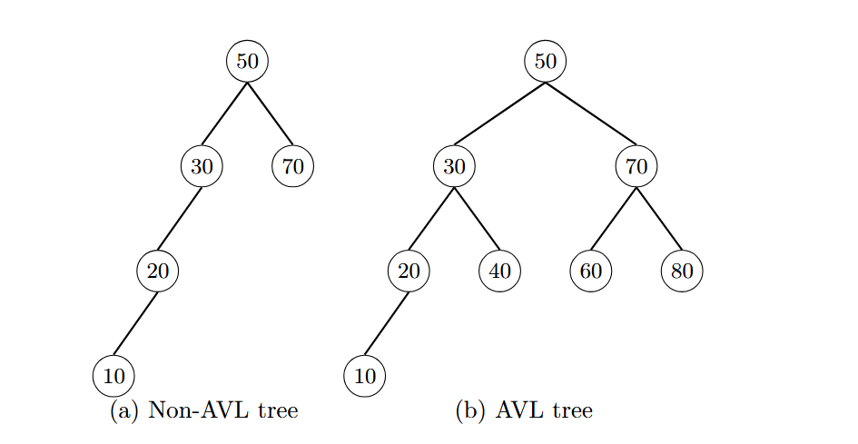
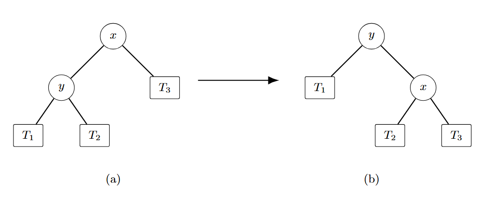
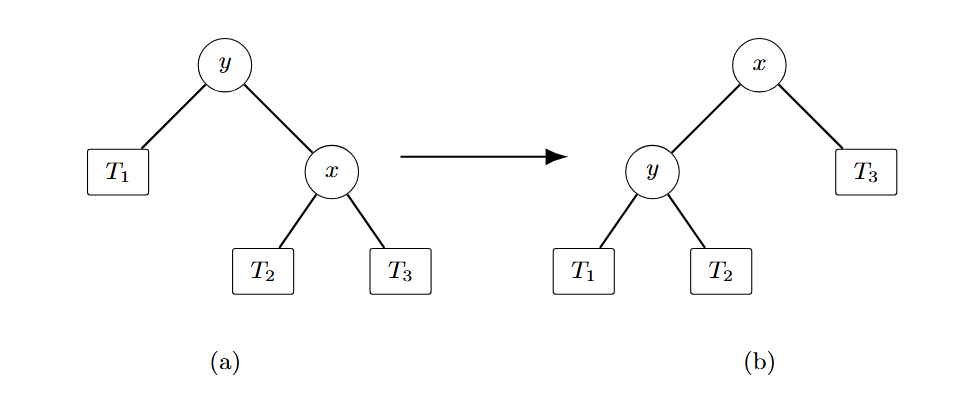
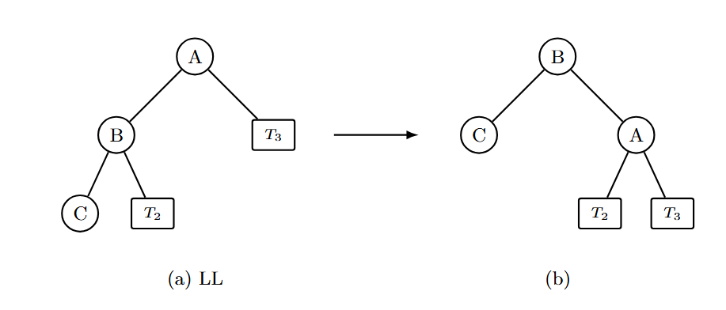
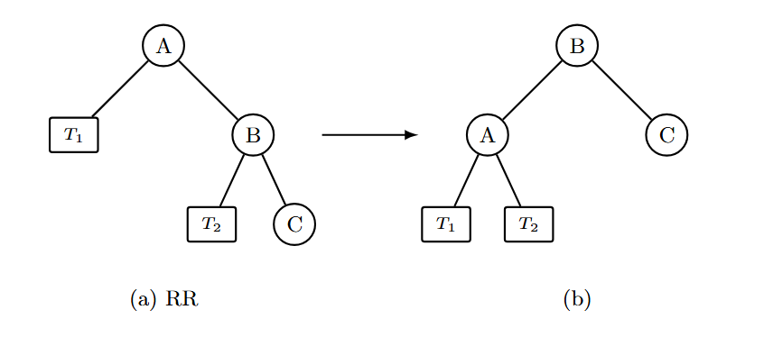
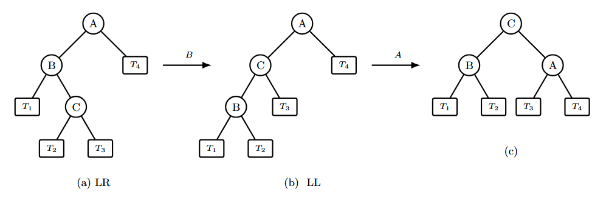
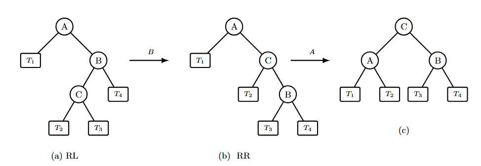

# AVL Trees

​	我们知道，对于一棵二叉搜索树，其对点的操作代价为 $O(log⁡n)$。然而在最坏情况下，它会退化成$O(n)$，例如这是一棵只有左孩子树的链型二叉树，那么操作这里唯一的叶孩子节点就是$O(n)$。

​	换句话来说，一棵二叉树的维护成本基本上与其高度正相关。因而一个很自然的想法是，如果我们想让一棵二叉树好维护，那么就希望它的高度尽可能低，而在点数固定的情况下，一种朴素的思想是让节点尽可能“均匀”地分布在树上。

## AVL Trees

​	**概念**：
​	1.一个空的二叉树是一个 AVL 树；
​	2.如果二叉树 $T$ 是一个 AVL 树，则其左右子树 $T_{l}$ 和 $T_{r}$ 也都是AVL树，且满足$|h(T_l) - h(T_r)| \leq 1$;

​	**平衡因子**：一个节点的平衡因子用来描述一个节点的平衡状态，对于节点 $T_p$，它的左孩子树为 $T_l$，右孩子树为 $T_r$，则：
$$
BF(T_p) = h(T_l) - h(T_r)
$$
e.g

> 上图中，图(a)中节点30，节点50不是平衡点，这棵树不是AVL树。图(b)是一棵AVL树

## AVL Trees 的高度

​	AVL树的高度而已被证明为 **$O(log N)$**,证明如下

> 我们记 $n_h$ 是高度为 $h$ 的 AVL 树所包含的最少节点数，则有如下递推关系：
>
> $$
> n_h = \begin{cases}
> 1 & (h = 0) \\
> 2 & (h = 1) \\
> n_{h-1} + n_{h-2} + 1 & (h > 1)
> \end{cases}
> $$
>
> 发现 $n_h + 1$ 符合 Fibonacci 数列的递推公式（但是初始条件不一样），所以我们可以 用Fibonacci 对其进行一个估计。
>
> 而对于如下 Fibonacci 数列：
>
> $$
> F_i = \begin{cases}
> 1 & (i = 1) \\
> 1 & (i = 2) \\
> F_{i-1} + F_{i-2} & (i > 2)
> \end{cases}
> $$
>
> 其通项为：
>
> $$
> \begin{aligned}
> F_n &= \frac{1}{\sqrt{5}} \left( \left( \frac{1 + \sqrt{5}}{2} \right)^n - \left( \frac{1 - \sqrt{5}}{2} \right)^n \right) \\
> &\approx \frac{1}{\sqrt{5}} \left( \frac{1 + \sqrt{5}}{2} \right)^n \\
> \log(F_n) &\approx n
> \end{aligned}
> $$
>
> 而 $n_h + 1 \approx F_{h+2}$，所以 $h \approx \log(n_h)$，也就是说 $h \approx \log N$。
>

## 对AVL树的操作

### 旋转

​	**旋转**：通过改变节点之间的父子指向，在不破坏二叉搜索树中序遍历有序性的前提下，调整子树的形态与高度。旋转只涉及常数个指针的修改，时间复杂度为 $O(1)$。
​	旋转分为两种基本形式：**左旋**和**右旋**。

​	**右旋（Right Rotation）**：

设节点 $x$ 有左孩子 $y$。以 $x$ 为轴进行右旋，操作如下：

- $y$ 取代 $x$ 成为该子树的新根；
-  $x$ 成为 $y$ 的右孩子；
-  $y$ 原来的右子树 $T_2$ 成为 $x$ 的左子树；
-  $x$ 原来的右子树 $T_3$ 保持不变。

也可以形象的理解为将 $y$ 拎起来,并将 $T_2$ 挂到 $x$ 上。

**指针变化**：
$$
x.\text{left} \leftarrow y.\text{right},\qquad y.\text{right} \leftarrow x
$$

​	**左旋（Left Rotation）**：

设节点 $y$ 有右孩子 $x$。以 $y$ 为轴进行左旋，操作如下：

- $x$ 取代 $y$ 成为该子树的新根；
- $y$ 成为 $x$ 的左孩子；
- $x$ 原来的左子树 $T_2$ 成为 $y$ 的右子树；
- $y$ 原来的左子树 $T_1$ 保持不变。

也可以形象的理解为将 $x$ 拎起来,并将 $T_2$ 挂到 $y$ 上。

**指针变化**：
$$
y.\text{right} \leftarrow x.\text{left},\qquad x.\text{left} \leftarrow y
$$

​	**旋转的性质** ：

- **保持二叉搜索树性质**：旋转前后中序遍历序列完全一致。
- **局部性**：只影响参与旋转的节点及其子树，其余部分不受影响。
- **可逆性**：一次右旋后可通过一次左旋恢复原状。
- **高度调整**：旋转可降低较高子树的高度，提升较矮子树的高度，从而用于平衡。

### 插入

​	对AVL树的插入操作可以简单概括为：
- 像BST里一样插入数值

- 通过旋转操作保持平衡

​	在第一步插入之后，往往会产生新的不平衡点，这些不平衡点是新插入的节点的父节点及其祖先节点，于是需要第二步调整。

​	根据不平衡形态，旋转分为四种基本类型：

#### LL 型：右单旋

​	**定义**：在 $A$ 的左孩子的左子树上插入节点，导致 $A$ 失衡，即  
$$
BF(A)>1,\quad BF(A.\text{left})\ge 0
$$
​	**操作**：以 $A$ 的左孩子 $B$ 为轴，对 $A$ 进行**右旋**：

#### RR 型：左单旋

​	**定义**：在 $A$ 的右孩子的右子树上插入节点，导致 $A$ 失衡，即  
$$
BF(A)<-1,\quad BF(A.\text{right})\le 0
$$
​	**操作**：以 $A$ 的右孩子 $B$ 为轴，对 $A$ 进行**左旋**：

#### LR 型：先左后右双旋

​	**定义**：在 $A$ 的左孩子的右子树上插入节点，导致 $A$ 失衡，即  
$$
BF(A)>1,\quad BF(A.\text{left})<0
$$
​	**操作**：分两步：
1. 先对 $A$ 的左孩子 $B$ 进行**左旋**，将其变为 LL 型；
2. 再对 $A$ 进行**右旋**。
    最终由 $B$ 的右孩子 $C$ 取代 $A$ 成为新根。

####  RL 型：先右后左双旋

​	**定义**：在 $A$ 的右孩子的左子树上插入节点，导致 $A$ 失衡，即  
$$
BF(A)<-1,\quad BF(A.\text{right})>0
$$
​	**操作**：分两步：
1. 先对 $A$ 的右孩子 $B$ 进行**右旋**，将其变为 RR 型；
2. 再对 $A$ 进行**左旋**。
    最终由 $B$ 的左孩子 $C$ 取代 $A$ 成为新根。

#### 旋转操作的对象顺序

​	由于旋转操作不会改变当前节点$A$以上的节点，所以我们在具体处理一棵由于插入了新节点导致产生的多个不平衡点时，采用的顺序是从下至上依次处理这些不平衡点。但是较为特殊的是，由于因为插入而引起的不平衡点在旋转后子树的高度会变为未插入前子树的高度，所以我们只需要处理新节点以上的第一个不平衡点即可使得整棵树平衡。

#### 时间复杂度

​	插入的时间复杂度中，第一步的时间复杂度是$O(logn)$,第二步是$O(1)$。

### 删除

​	对AVL树的删除操作可以简单概括为：

- 像BST里一样删除数值（即使用中序遍历的前驱节点代替被删除节点的位置）

- 通过旋转操作保持平衡

​	平衡操作与插入相似，分四种情况同样处理，但是
​	插入时，**旋转后子树高度恢复到插入前的高度**，因此祖先不受影响，只需一次旋转。
​	删除时，**旋转后子树高度可能仍然比删除前矮**，于是祖先的平衡因子继续变化，可能引发新的失衡。因此需要从下往上继续调整，最多进行 $O(log⁡n)$ 次旋转。

​	具体来说：

- 若旋转后子树高度恢复为删除前的高度，则可停止向上；
- 若旋转后子树高度仍比删除前矮 1，则需继续向上更新。

​	**总时间复杂度**：两步都是 $O(logn)$

> 对于删除而言，如果进一步将平衡条件放宽，例如改为比值$\frac{1}{k} \le \left|\frac{h_L}{h_R}\right| \le k$ ,就可以实现第二步也在常数个平衡调整次数下完成

# 红黑树（RBT）

## 红黑树的概念

​	**Extended Trees**:对任意一棵二叉树,原来的节点称为 **内部节点**（internal node）,所有空指针位置补上一个方形节点，称为 **外部节点**（external node）或叶子,补全后，每个内部节点都恰好有两个子节点。这样得到的树就是 **扩充二叉树**。

​	**红黑树（Red-Black Tree）**:称一棵BST为红黑树，如果它满足以下性质：

1. 每个内部节点是红色或黑色。
2. 根节点是黑色。
3. 所有外部节点(空指针）是黑色。
4. 红色节点的两个子节点必须是黑色（即不能出现连续两个红色节点）。
5. 从任一节点出发，到其所有叶子节点的路径上，黑色节点数目相同。

​	**黑高（Black height）**：从任一节点出发，到其所有叶子节点的所有路径上，黑色节点数目的最大值。节点 $u$  的黑高可以表示 $bh(u)$ 。

> 根据黑高的定义，第五点定义也可以表达为每个节点 $u$ 的子节点 $v$ 和 $w$ 满足 $bh(v)=bh(x)$。

> **性质**：如果用 $h(v)$ 表示节点 $v$ 的高度，$w$ 是 $v$ 的父节点，则有
>
> 1. $2bh(v) \ge h(v) \ge bh(v)$
> 2. $\frac{1}{2} \le \frac{h(v)}{h(w)} \le 2$

​	若红黑树有 $n$ 个内部节点，则他的高度满足
$$
h \le 2+2log_{2}(n+1)
$$

>证明：等价于证明，对于红黑树中每一个节点 $u$ ,$size(T_{u})$表示以 $u$ 为根节点的子树的内部节点数（不包括外部节点）
>$$
>size(T_u) \ge 2^{bh(u)-1}-1
>$$
>采用归纳法，对 $h(T_{u})$ 进行归纳：
>
>当 $T_{u}=1$ 时，子树是单独一个黑色的外部节点，$size(T_u)=0$ , $bh(u)=1$,成立。
>
>假设对于高度不超过 $k$ 的子树都成立，对于高度为 $k+1$ 的子树 $T_{u}$ ,它的左右子树分别为 $T_{v}$ 和 $T_{w}$ , $v$ 和 $w$ 的黑高都为 $bh$ ,则
>
>$$
>\begin{aligned}
>size(T_u) &= size(T_v)+size(T_w)+1\\
>&\ge2^{bh(v)-1}-1+2^{bh(v)-1}-1+1\\
>&=2^{bh}+1
>\end{aligned}
>$$
>
>同时， $bh(u)=bh+1$
>
>于是得证。

